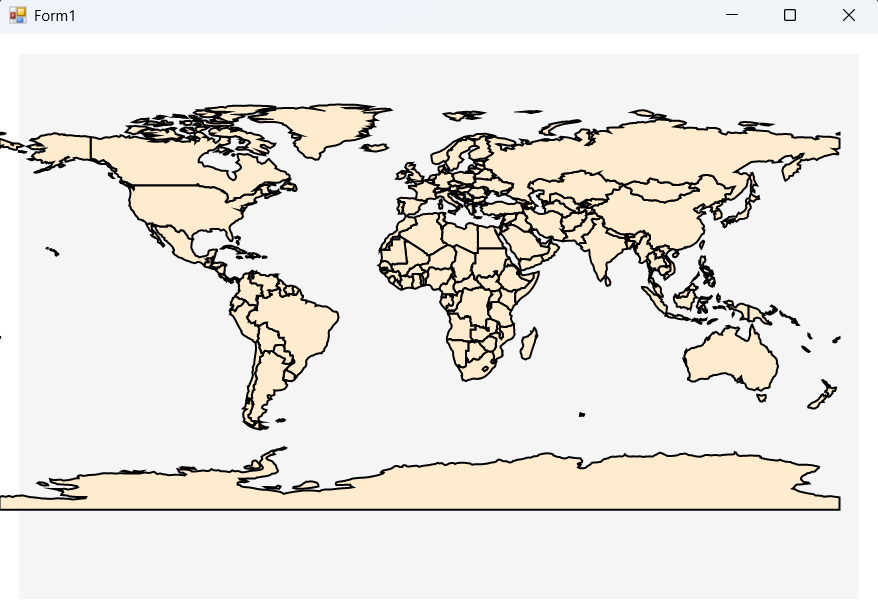

# Getting Started with Windows Forms Map

This sample demonstrates how to create and customize a Syncfusion® WinForms Maps control.

## Prerequisites

- Visual Studio 2022 or later
- .NET Framework 4.7.2 or later
- Syncfusion `Syncfusion.Maps.Windows` NuGet package

## Assembly Deployment

To use the Maps control, add the following NuGet packages to your project:

Open the **Package Manager Console** and run:

```
Install-Package Syncfusion.Maps.Windows
Install-Package Syncfusion.Shared.Base
Install-Package Syncfusion.Shared.Windows
Install-Package Syncfusion.Licensing
```

Or, add the references directly in your `.csproj` file:

```xml
<ItemGroup>
    <PackageReference Include="Syncfusion.Maps.Windows" Version="*" />
    <PackageReference Include="Syncfusion.Shared.Base" Version="*" />
    <PackageReference Include="Syncfusion.Shared.Windows" Version="*" />
    <PackageReference Include="Syncfusion.Licensing" Version="*" />
</ItemGroup>
```

## Adding Maps to the Form

### Step 1: Create a Windows Forms Application

Open Visual Studio, create a new **Windows Forms App** project targeting **.NET Framework 4.7.2** or higher.

### Step 2: Add the Maps Control

In the `Form1.Designer.cs` (or code-behind), initialize and add the `Maps` control:

```csharp
using Syncfusion.Windows.Forms.Maps;

// Initialize the Maps control
this.mapsControl1 = new Syncfusion.Windows.Forms.Maps.Maps();

// Set properties
this.mapsControl1.Name = "mapsControl1";
this.mapsControl1.Size = new System.Drawing.Size(880, 585);

// Add to the form
this.Controls.Add(this.mapsControl1);
```

### Step 3: Add a Shape File Layer

In the `Form1.cs` file, add a ShapeFileLayer to display map data:

```csharp
using Syncfusion.Windows.Forms.Maps;
using System;
using System.Windows.Forms;

public partial class Form1 : Form
{
    public Form1()
    {
        InitializeComponent();
    }

    private void Form1_Load(object sender, EventArgs e)
    {
        ShapeFileLayer shapeLayer = new ShapeFileLayer();
        shapeLayer.Uri = "world1.shp";
        this.mapsControl1.Layers.Add(shapeLayer);
    }
}
```

## Running the Sample

1. Clone or download this repository.
2. Open `MapsGettingStarted.sln` in Visual Studio.
3. Restore NuGet packages.
4. Build and run the project (`F5`).



## References

- [Syncfusion WinForms Maps Documentation](https://help.syncfusion.com/windowsforms/map/getting-started)
- [Syncfusion WinForms Maps API Reference](https://help.syncfusion.com/cr/windowsforms/Syncfusion.Windows.Forms.Maps.html)